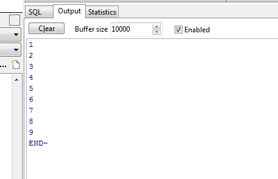
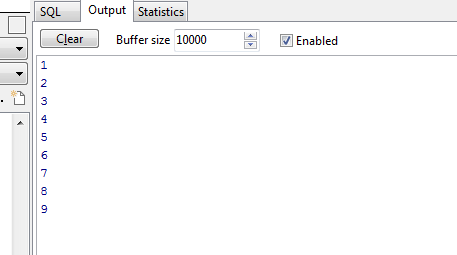
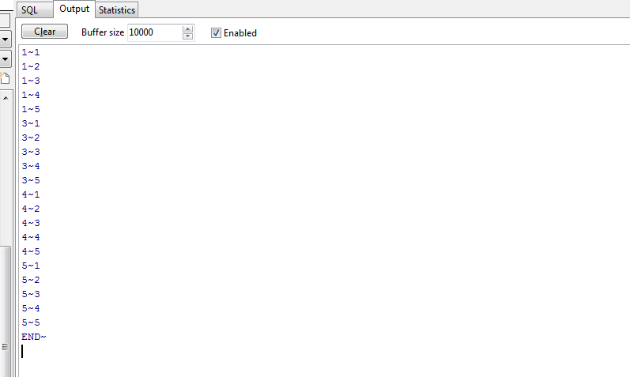
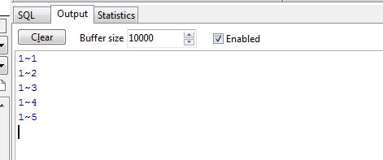
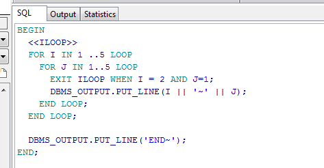
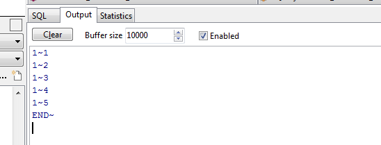

## ORACLE中exit与return区别


### 简单说明

  return - 跳出整个程序，以后的代码都不再执行。

  exit      - 跳出本次循环，下次继续执行。


### 案例

单次循环

- exit

```sql
BEGIN
  FOR I IN 1 .. 100 LOOP
    DBMS_OUTPUT.PUT_LINE(I);
    EXIT WHEN I = 9;
  END LOOP;

  DBMS_OUTPUT.PUT_LINE('END~');
END;
```

执行结果：

```
1
2
3
4
5
6
7
8
9
END~
```



- return

```sql
BEGIN
  FOR I IN 1 .. 100 LOOP
    DBMS_OUTPUT.PUT_LINE(I);
    IF I = 9 THEN
      RETURN;
    END IF;
  END LOOP;

  DBMS_OUTPUT.PUT_LINE('END~');
END;
```


```
1
2
3
4
5
6
7
8
9
```



嵌套循环

- exit

```sql
BEGIN
  FOR I IN 1 ..5 LOOP
    FOR J IN 1..5 LOOP
      IF I = 2 AND J=1 THEN
        EXIT;
      END IF;
      DBMS_OUTPUT.PUT_LINE(I || '~' || J);
    END LOOP;
  END LOOP;

  DBMS_OUTPUT.PUT_LINE('END~');
END;
```

```
1~1
1~2
1~3
1~4
1~5
3~1
3~2
3~3
3~4
3~5
4~1
4~2
4~3
4~4
4~5
5~1
5~2
5~3
5~4
5~5
END~
```



- return

```sql
BEGIN
  FOR I IN 1 ..5 LOOP
    FOR J IN 1..5 LOOP
      DBMS_OUTPUT.PUT_LINE(I || '~' || J);
      IF I = 2 AND J=1 THEN
        RETURN;
      END IF;
    END LOOP;
  END LOOP;

  DBMS_OUTPUT.PUT_LINE('END~');
END;
```

```
1~1
1~2
1~3
1~4
1~5
```



两次比较，显而易见，return是后面的什么代码都不会在执行，确切的说，应该是终止程序执行了（这一点和网上很多博客的说法不一致，这也是我亲自测试之后的结果），exit只是跳出本次循环，外层的for循环仍然会继续执行。


那么，exit如何终止外面的for循环呢？

```sql
BEGIN
  <<ILOOP>>
  FOR I IN 1 ..5 LOOP
    FOR J IN 1..5 LOOP
      EXIT ILOOP WHEN I = 2 AND J=1;
      DBMS_OUTPUT.PUT_LINE(I || '~' || J);
    END LOOP;
  END LOOP;

  DBMS_OUTPUT.PUT_LINE('END~');
END;
```

输出的结果：

```
1~1
1~2
1~3
1~4
1~5
END~
```





<p align="right">武汉·洪山广场</p>

<p align="right">2018年7月</p>
